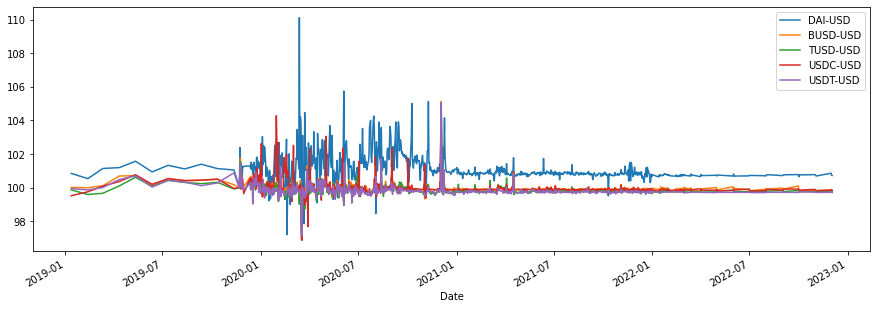
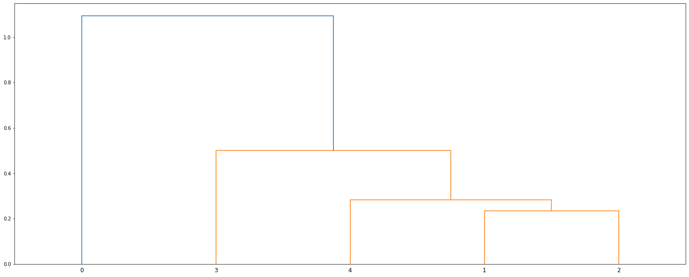
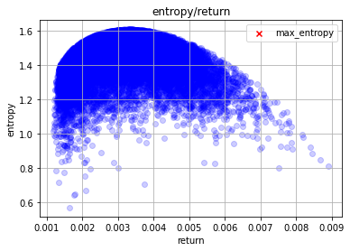

# Stablecoin Portfolio Analysis

I have taken a few notebooks I had created earlier for my capstone project and have run the analysis on them. I created these notebooks while researching on efficient methods of portfolio optimization. I have excluded markowitzian efficient frontier analysis, as it is extremely flawed and has been repeatedly proven wrong. 

My approach (coincidentally) has been the same as that described in only crpto quant risk management book **Financial Risk Management for Cryptocurrencies by Eline Van der Auwera, et al.**. The quantitative approach for analysing returns is a general one and assumes all processes (in the typical bidding/bid-ask scenario) to be a signal. For a more indepth report, please read file `Entropy_Original.pdf` included in the repository.

The following are the time series processes of the respective stablecoin assets we are looking at

As we can see, the first and second quarter of 2020 was riddled with Covid-19 problems worldwide which included lockdown restrictions and rapid increase in mortality rates. We can see that DAI-USD experienced volatility in price from first quarter 2020 till th end of the year 2020, which could be attributed to the fact that it is created from an overcollateralized loan and repayment process facilitated by MakerDAO's smart contracts in the form of a decentralized application. 

Nevertheless, to keep the analysis objective and devoid of sentimental bias, we have taken randomly selected five stablecoins pegged against the USD (which is obvious as USD currently is 92% of the currency worldwide, although that might change in the upcoming months). 

## Equal Risk Contribution (ERC) - All stablecoin have the same risk parameter

Following is the output from the notebook 

|          | Weight    |
| -------- | --------- |
| DAI-USD  | 17.199826 |
| BUSD-USD | 20.664406 |
| TUSD-USD | 21.716573 |
| USDC-USD | 20.057629 |
| USDT-USD | 20.361566 |

|      | Details         | Amount in Mn  |
| ---- | --------------- | ------------- |
| 0    | Portfolio Value | 1.000000e+07  |
| 1    | Daily_VaR_95    | -4.381847e+06 |
| 2    | Monthly_VaR95   | -2.055268e+07 |
| 3    | Daily_VaR_99    | -9.138756e+06 |
| 4    | Monthly_VaR99   | -4.286456e+07 |
| 5    | Daily_CVAR_95   | -7.782361e+06 |
| 6    | Daily_CVAR_99   | -1.486139e+0  |

## Equal Weights - All stablecoin have the same portfolio weights i.e 20% each

|      | Details         | Amount in Mn  |
| ---- | --------------- | ------------- |
| 0    | Portfolio Value | 1.000000e+07  |
| 1    | Daily_VaR_95    | -2.557372e+04 |
| 2    | Monthly_VaR95   | -1.199514e+05 |
| 3    | Daily_VaR_99    | -6.856489e+04 |
| 4    | Monthly_VaR99   | -3.215978e+05 |
| 5    | Daily_CVAR_95   | -5.953524e+04 |
| 6    | Daily_CVAR_99   | -1.230286e+05 |

## Hierarchical Risk Parity (HRP) - Stablecoin portfolio is decided on the basis of HRP technique

|          | Weight   |
| -------- | -------- |
| DAI-USD  | 0.086206 |
| BUSD-USD | 0.119251 |
| TUSD-USD | 0.143065 |
| USDC-USD | 0.403979 |
| USDT-USD | 0.247499 |

|      | Details         | Amount in Mn  |
| ---- | --------------- | ------------- |
| 0    | Portfolio Value | 1.000000e+07  |
| 1    | Daily_VaR_95    | -3.689083e+04 |
| 2    | Monthly_VaR95   | -1.730333e+05 |
| 3    | Daily_VaR_99    | -8.303409e+04 |
| 4    | Monthly_VaR99   | -3.894644e+05 |
| 5    | Daily_CVAR_95   | -6.922798e+04 |
| 6    | Daily_CVAR_99   | -1.348862e+05 |

## Maximum Entropy (MaxEnt) - Stablecoin portfolio is decided on the basis of MaxEnt technique

| objective function entropy | Weight                 |
| -------------------------- | ---------------------- |
| DAI-USD                    | 3.7705864335799699205  |
| BUSD-USD                   | -0.0000000002310467725 |
| TUSD-USD                   | 0.0000000848634247131  |
| USDC-USD                   | 0.0000000020392225392  |
| USDT-USD                   | 0.0000000042719641833  |

|                  |                      |
| ---------------- | -------------------- |
| portfolio risk   | 0.5038462098003937   |
| portfolio return | 0.042217853474472336 |

|      | Details         | Amount in Mn  |
| ---- | --------------- | ------------- |
| 0    | Portfolio Value | 1.000000e+07  |
| 1    | Daily_VaR_95    | -4.132154e+05 |
| 2    | Monthly_VaR95   | -1.938152e+06 |
| 3    | Daily_VaR_99    | -8.727274e+05 |
| 4    | Monthly_VaR99   | -4.093454e+06 |
| 5    | Daily_CVAR_95   | -7.821776e+05 |
| 6    | Daily_CVAR_99   | -1.465996e+06 |
